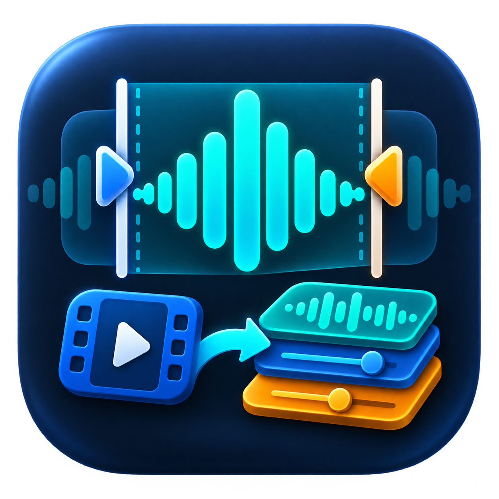

# Audio Atelier v1.2

動画から必要な音声を切り出し、複数の音声をタイムライン上で並べたり重ねたりできるWindows用デスクトップアプリです。

作った人：電々（[@den2_nova](https://x.com/den2_nova)）



## 主な機能

- 動画・音声ファイルの波形表示
- 波形上での切り出し範囲指定と試聴
- 複数音声の連結、無音時間の調整、重ね合わせ
- タイムライン上での開始位置・レーン変更
- WAV・MP3・M4A形式での書き出し
- 再生位置を示すプレイヘッド
- 切り出し範囲と合成クリップ両端への約10msの自動フェード
- 合成時のピーク超過を抑えるリミッター
- GUIとCLIで共通利用できるJSONプロジェクト
- `probe`・`trim`・`mix`を画面なしで実行できるCLI
- クリップごとのトリム、音量、フェード、ループ、ミュート
- 任意のLUFSノーマライズとTrue Peak上限設定
- インストール不要の単一EXEビルド

## ダウンロード

ソースコードは、このページの「Code」からZIP形式でダウンロードできます。

すぐに使えるビルド済みWindows版は、右側の[Releases](../../releases)から`AudioAtelier-v1.2-Windows.zip`をダウンロードしてください。配布ZIPには`AudioAtelier.exe`と詳しい`README.txt`が入っています。

## 必要環境

- Windows 10／11
- Python 3.11以降（ソースから実行・ビルドする場合）
- FFmpegの`ffmpeg.exe`と`ffprobe.exe`
- 試聴機能には`ffplay.exe`も必要

FFmpegは次の順番で検索します。

1. `AudioAtelier.exe`と同じフォルダ
2. `bin`フォルダ
3. `ffmpeg`フォルダ
4. `ffmpeg\bin`フォルダ
5. Windowsの`PATH`

wingetが利用できる場合は、PowerShellから次のコマンドで導入できます。

```powershell
winget install --id Gyan.FFmpeg.Essentials -e
```

詳しい導入方法とトラブル対処は[README.txt](README.txt)を参照してください。

## ソースから実行する

```powershell
python app.py
```

GUIはPython標準のTkinterを使用しています。音声処理は外部のFFmpegコマンドを呼び出します。

## CodexやPowerShellからCLIで使う

引数を付けずに起動するとGUIが開きます。サブコマンドを指定した場合はGUIを開かず、処理完了まで待って終了コードと結果を返します。

```powershell
AudioAtelier.exe probe --input input.mp4 --json

AudioAtelier.exe trim `
  --input input.mp4 --start 12.5 --end 18.2 `
  --output voice.wav --json

AudioAtelier.exe mix `
  --project project.json --output final_mix.wav --json
```

`--dry-run`ではFFmpegコマンドと`filter_complex`を処理前に確認できます。既存ファイルを上書きする場合は`--overwrite`を明示します。JSONプロジェクトのフィールドと実行例は[README.txt](README.txt)を参照してください。

## 単一EXEをビルドする

PowerShellで次を実行します。

```powershell
.\build.ps1
```

スクリプトがPyInstallerをインストールし、`version_info.txt`のバージョン情報を組み込んだ`dist\AudioAtelier.exe`を生成します。FFmpeg本体はEXEへ同梱しません。

## 主な対応形式

- 動画入力：MP4、MOV、MKV、AVI、WebM、M4V、WMV、MPEG、MPG
- 音声入力：WAV、MP3、M4A、AAC、FLAC、OGG、WMA、Opus
- 音声出力：WAV、MP3、M4A

実際に読み込める形式は、使用しているFFmpegのビルドに準じます。

## 注意事項

本ソフトは個人制作の無料ツールです。大切なファイルは、あらかじめバックアップを取ってからご利用ください。

FFmpegは本リポジトリおよび配布ZIPには含まれていません。FFmpegの利用条件は、入手元の案内をご確認ください。
